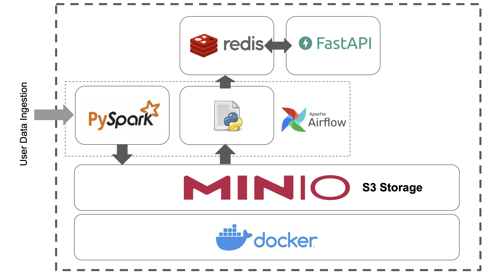

# Kueski - Machine Learning Engineer Challenge

## Description

This code corresponds to Kueski machine learning engineer challenge.

Candidate: Alejandro Debus

## Execution instructions

```
docker-compose up --build -d
```

## Architecture

In this image you can see the basic infrastructure that has been built for the development of the proposed challenge.


